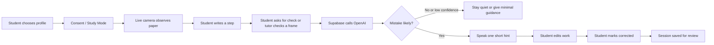
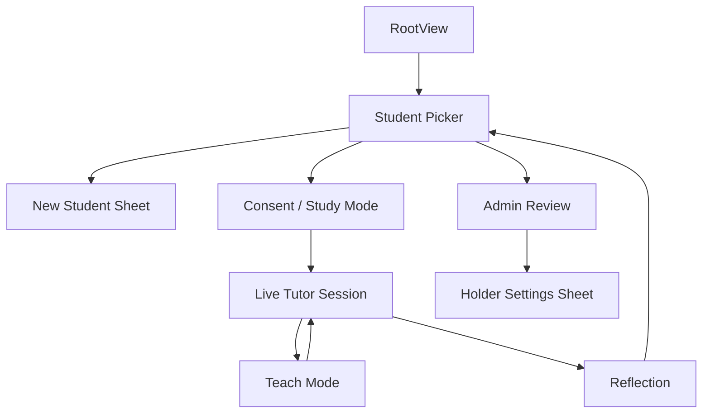
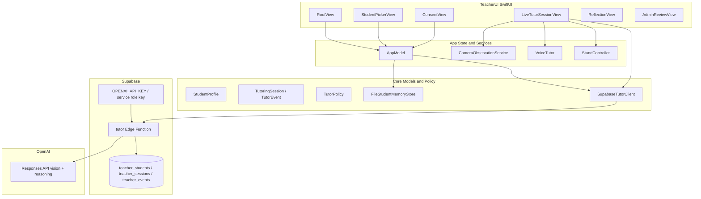
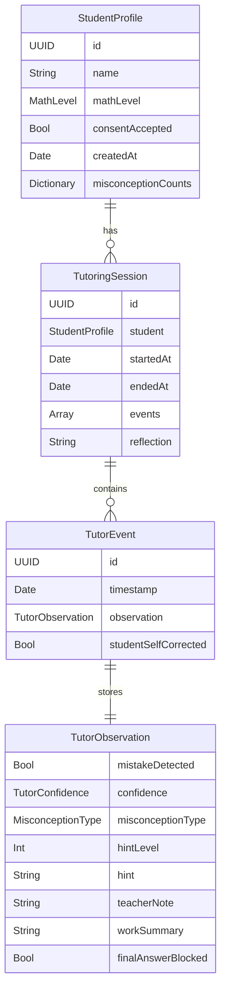
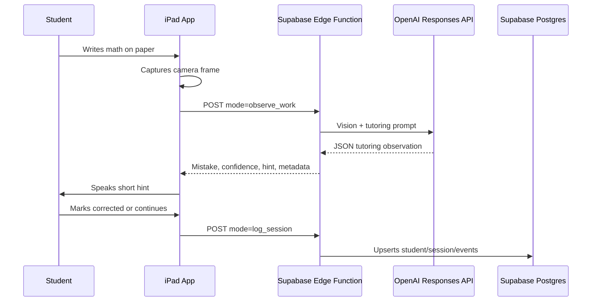
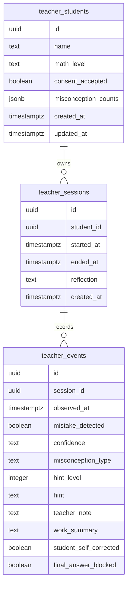
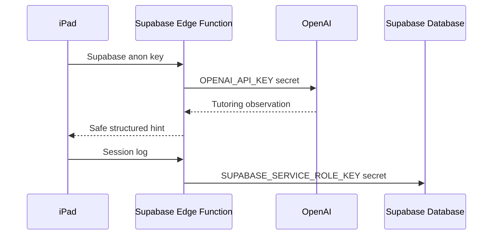
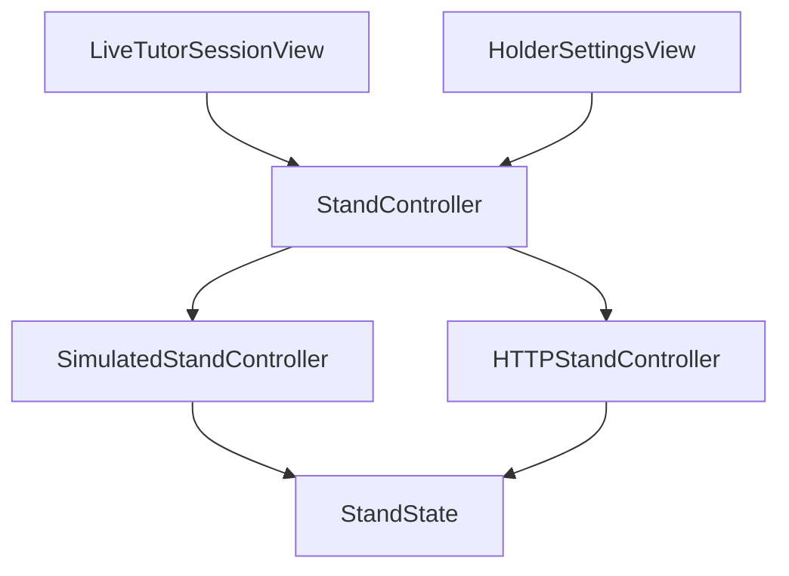

# MathTutor


MathTutor is an iPad-first research prototype for a real-time guided math tutor. The app watches a student solve math on paper, detects likely process mistakes, and gives short voice hints that guide the student without revealing the answer.

The goal is not to build another scanner or answer engine. The goal is to build a tutor that behaves more like a patient teacher: quiet while the student thinks, attentive when the student gets stuck, and personal over time because it remembers each student's name, level, and recurring mistake patterns.

## One-Sentence Pitch

MathTutor turns an iPad into a quiet, camera-based math coach that observes handwritten work, remembers student misconceptions, and gives guided voice hints only when they support learning.

## Research Motivation

Most math-help apps are optimized for finishing the problem. A student scans a question, receives generated steps, and can often copy the final answer without developing the reasoning. MathTutor is designed around a different research question:

> Can an AI tutor improve learning by watching the process, remembering the learner, and intervening like a teacher instead of solving like a calculator?

That is the main innovation of this version.

| Typical solver app | MathTutor JuneVersion |
| --- | --- |
| Scans a completed problem | Watches the problem develop on paper |
| Gives generated steps and often an answer | Gives short tutor hints |
| Treats each user the same | Tracks student-specific patterns |
| Optimizes for completion | Optimizes for self-correction |
| Uses a chat or answer panel as the main surface | Keeps the camera and paper as the main surface |
| Helps after the student is done | Helps during the learning process |

## Current Product Scope

MathTutor V1 is API-first and iPad-only.

| Area | V1 Decision |
| --- | --- |
| Runtime device | iPadOS only |
| Build machine | Mac Studio / Xcode |
| UI framework | SwiftUI |
| Architecture style | MVVM-like app state with focused service objects |
| AI reasoning | OpenAI Responses API through Supabase Edge Functions |
| Camera | AVFoundation live preview and still-frame capture |
| Voice output | Apple speech synthesis through `AVSpeechSynthesizer` |
| Backend | Supabase Edge Function and Postgres tables |
| Secret handling | OpenAI key stays server-side in Supabase secrets |
| Student memory | Local JSON store plus Supabase session logging |
| Local models | Deferred to V2 if privacy, cost, offline use, or research novelty requires it |

## Product Experience



The app is intentionally calm. Student-facing screens avoid dashboard panels, dense analytics, decorative animation, glass effects, and large prose blocks. The learning should happen on the student's paper, not inside a busy app interface.

## Hands-Free Voice Control

MathTutor now includes an app-level voice command layer so the student can control the main tutoring loop without reaching over the paper.

Files:

```text
MathTutorSwift/iPadApp/MathTutor/MathTutor/TeacherUI/VoiceControl/
```

Voice control is split into four responsibilities:

| File | Responsibility |
| --- | --- |
| `VoiceCommand.swift` | Defines supported command intents and phrase matching |
| `VoiceControlState.swift` | Tracks permission, listening, transcript, command, confidence, and mode |
| `VoiceCommandRecognizer.swift` | Uses Apple Speech and microphone APIs to listen for commands |
| `VoiceCommandRouter.swift` | Maps commands to valid app actions based on current context |
| `VoiceControlIndicator.swift` | Tiny student-facing microphone state indicator |
| `VoiceDebugPanel.swift` | Admin-only debug/test surface for voice routing |

Supported command groups:

| Group | Example phrases |
| --- | --- |
| Start | "Start", "Start session", "Begin tutoring" |
| Observe / return | "Back to work", "Return to work", "Watch my work" |
| Teach / show | "Show me", "Help me", "Teach me", "I'm stuck" |
| Step control | "Next", "Repeat", "Different way", "Slower" |
| Question | "Question", "I have a question", "Wait", "Hold on" |
| Pause / resume | "Pause", "Stop listening", "Resume", "Keep going" |
| Emergency | "Stop", "Emergency stop", "Freeze", "Stop moving" |
| Confirmation | "I understand", "Got it", "That makes sense", "Continue" |

Voice routing is context-aware. For example, "start" only starts from a ready state, "show me" only enters Teach Mode during a live session, "next" only changes the math display in Teach Mode, and emergency stop is routed to the holder immediately when holder controls are active.

Student-facing voice UI stays minimal:

- Student Picker, Consent, Live Session, and Teach Mode show only a tiny microphone indicator.
- No transcript panels are shown to students.
- Voice debug details are only visible from Admin / Holder settings.
- If speech recognition permission is denied, the app remains fully usable through touch controls.

## Page Map



## Page-by-Page Documentation

### Student Picker

File:

```text
MathTutorSwift/iPadApp/MathTutor/MathTutor/TeacherUI/StudentPickerView.swift
```

Purpose:

The Student Picker is the first student-facing page. It lets the tutor, professor, or student choose who is about to work.

Design:

- Centered on a notebook-grid background.
- Shows only the MathTutor name, student rows, and icon controls.
- Avoids analytics, scores, performance cards, and dashboard-style summaries.
- Uses student initials in a flat square mark.
- Keeps Admin Review available through a small book icon, but does not make admin data part of the student experience.

Visible controls:

| Control | Icon | Behavior |
| --- | --- | --- |
| Create student | `person.badge.plus` | Opens the new student sheet |
| Begin session | `arrow.right` | Selects the student and routes to consent or live session |
| Admin review | `book.closed` | Opens professor/mentor review mode |

Accessibility:

Icon-only buttons include accessibility labels such as "Create student", "Begin session", and "Open admin review".

State used:

- `appModel.students`
- `selectedStudentID`
- `showingNewStudent`

### New Student Sheet

File:

```text
MathTutorSwift/iPadApp/MathTutor/MathTutor/TeacherUI/StudentPickerView.swift
```

Purpose:

Creates a new `StudentProfile`.

Fields:

| Field | Type | Notes |
| --- | --- | --- |
| Student name | Text | Stored locally and sent in session context |
| Math level | Picker | Algebra I, Algebra II, SAT Math, or Precalculus |

On create:

1. A new `StudentProfile` is created.
2. `AppModel.saveStudent(_:)` writes it to local memory.
3. The sheet dismisses.

### Consent / Study Mode

File:

```text
MathTutorSwift/iPadApp/MathTutor/MathTutor/TeacherUI/ConsentView.swift
```

Purpose:

Confirms that the session can be logged and that no-answer tutoring mode is active.

Design:

- Minimal notebook page.
- No header or footer.
- Student name is the main visible text.
- Uses two simple switches and two icon controls.

Controls:

| Control | Behavior |
| --- | --- |
| Study log toggle | Must be enabled to begin |
| No answers toggle | Locked on for V1 |
| Return icon | Goes back to Student Picker |
| Camera icon | Starts the tutoring session |

Why this page exists:

Because this is a research prototype. The app is tracking educational interactions, and the user should clearly know when logging is active.

### Live Tutor Session

File:

```text
MathTutorSwift/iPadApp/MathTutor/MathTutor/TeacherUI/LiveTutorSessionView.swift
```

Purpose:

The main tutoring page. This is where the iPad watches the student's paper.

Design:

- Camera preview fills the screen.
- A simple dashed rectangle suggests where the paper should be placed.
- No dashboard header.
- No chat panel.
- No floating explanation wall.
- A compact icon strip sits at the bottom.
- A small sticky-note style hint appears only when there is something useful to show.

Visible controls:

| Control | Icon | Behavior |
| --- | --- | --- |
| Check work | `viewfinder` | Captures a frame and asks the backend to analyze it |
| Pause/resume | `pause.fill` / `play.fill` | Temporarily pauses observation flow |
| Ask question | `questionmark` | Student interruption / confused marker |
| Teach Mode | `rectangle.inset.filled.and.person.filled` | Enters math-only teaching screen |
| Mark corrected | `checkmark` | Marks the last tutor event as self-corrected |
| Repeat hint | `speaker.wave.2` | Replays the current voice hint |
| End session | `xmark` | Ends session and routes to Reflection |

Important behavior:

1. The app starts the camera on `.task`.
2. The holder controller is sent to Observe Mode.
3. `checkWork()` captures the current camera frame.
4. The frame is base64 encoded.
5. `SupabaseTutorClient.observeWork(_:)` sends the frame and student context to Supabase.
6. The returned hint is passed through `TutorPolicy`.
7. If the policy says the app should interrupt, `VoiceTutor` speaks the hint.
8. The observation becomes a `TutorEvent` in the current `TutoringSession`.

### Mistake Moment Note

File:

```text
MathTutorSwift/iPadApp/MathTutor/MathTutor/TeacherUI/LiveTutorSessionView.swift
```

Purpose:

This is not a separate route. It is a temporary note inside the Live Tutor Session.

When it appears:

- A mistake observation exists.
- The student marked confusion.
- The backend returned an error.
- The holder controller returned an error.

Design:

- Small muted yellow note.
- One or two lines maximum.
- Does not cover the camera view.
- Keeps the student's paper visually dominant.

### Teach Mode

File:

```text
MathTutorSwift/iPadApp/MathTutor/MathTutor/TeacherUI/LiveTutorSessionView.swift
```

Purpose:

Teach Mode turns the iPad screen toward the student and displays only math steps. It is meant to teach through the structure of the math, not through a paragraph explanation.

Hard rule:

Teach Mode shows math only. It does not show prose explanations.

Example display:

```text
3(x + 2)
= 3x + 3*2
= 3x + 6
```

Current misconception-specific examples:

| Misconception | Example math shown |
| --- | --- |
| Distribution | `3(x + 2)`, `= 3x + 3*2`, `= 3x + 6` |
| Sign error | `-2x + 5 = 11`, `-2x = 6`, `x = -3` |
| Equation balance | `2x + 7 = 15`, `2x = 15 - 7`, `2x = 8`, `x = 4` |
| Invalid cancellation | `(x + 3) / x`, `!= 1 + 3`, `= 1 + 3/x` |
| Slope/intercept | `y = mx + b`, `y = 2x + 3`, `m = 2`, `b = 3` |
| Factoring | `x^2 + 5x + 6`, `= (x + 2)(x + 3)` |
| SAT strategy | `2x + 6 = 18`, `2(x + 3) = 18`, `x + 3 = 9` |

Visible controls:

| Control | Icon | Behavior |
| --- | --- | --- |
| Ask question | `questionmark` | Switches to an alternate math-step view and speaks a short cue |
| Understood | `checkmark` | Returns to camera observation |
| Return to work | `return` | Returns to camera observation |
| Emergency stop | `stop.fill` | Sends holder stop command when holder is in Teach Mode |

Teach Mode entry behavior:

- Starts immediately when the student taps the Teach icon.
- Sets `isTeachMode = true`.
- Pauses observation.
- Sends `teachMode` to the holder controller.
- Displays centered math steps automatically.

### Reflection

File:

```text
MathTutorSwift/iPadApp/MathTutor/MathTutor/TeacherUI/ReflectionView.swift
```

Purpose:

Shows a short post-session summary after the student ends a session.

Content:

- Total checks.
- Mistakes detected.
- Self-corrections.
- A short "what improved" note.
- A short "what was hard" note.
- Recent tutor moments.

Design:

- Notebook-style research summary.
- Does not frame the session as a grade.
- Reinforces self-correction and progress.

Route:

`Live Tutor Session -> endSession() -> AppModel.finishSession(_:) -> Reflection`

### Admin Review

File:

```text
MathTutorSwift/iPadApp/MathTutor/MathTutor/TeacherUI/AdminReviewView.swift
```

Purpose:

Protected-style review mode for a professor, mentor, or researcher. V1 does not yet implement authentication, but the screen is separated from student-facing flow.

Content:

- Student count.
- Session count.
- Total mistakes.
- Total self-corrections.
- Per-student misconception history.
- Recent sessions.
- Holder settings access.

Design:

- Sparse student history.
- More detailed than student-facing pages, but still not a business dashboard.
- Uses quiet counts and table-like rows instead of large analytics panels.

### Holder Settings

Files:

```text
MathTutorSwift/iPadApp/MathTutor/MathTutor/TeacherUI/StandControl/
```

Purpose:

Prototype controls for a future motorized iPad holder. This is app-side software only; hardware is not required for V1.

Modes:

| Mode | Meaning |
| --- | --- |
| Observe Mode | Rear camera points toward the paper |
| Teach Mode | Screen faces the student |
| Moving | Holder command is in progress |
| Stopped | Emergency stop state |
| Error | Holder command failed |

Commands:

| Command | Intended hardware behavior |
| --- | --- |
| Observe Mode | Rotate to paper-facing camera position |
| Teach Mode | Rotate screen toward student |
| Pitch Down | Fine adjustment toward paper |
| Pitch Up | Fine adjustment toward student |
| Center | Neutral position |
| Emergency Stop | Stop all movement |

Implementation:

- `StandController` chooses simulated or HTTP control.
- `SimulatedStandController` pretends to move without hardware.
- `HTTPStandController` is prepared for future ESP32/local network endpoints.
- Holder errors do not block the tutoring UI.

## App Architecture

MathTutor uses a simple layered architecture:



## Core Responsibilities

### `MathTutorApp`

File:

```text
MathTutorSwift/iPadApp/MathTutor/MathTutor/MathTutorApp.swift
```

Creates the SwiftUI app and injects `AppModel` into the environment.

### `RootView`

File:

```text
MathTutorSwift/iPadApp/MathTutor/MathTutor/TeacherUI/RootView.swift
```

Owns route switching. It renders the correct page for the current `AppModel.Route`.

Routes:

```swift
case studentPicker
case consent(StudentProfile)
case liveSession(StudentProfile)
case reflection(TutoringSession)
case admin
```

### `AppModel`

File:

```text
MathTutorSwift/iPadApp/MathTutor/MathTutor/TeacherUI/AppModel.swift
```

Main app state object.

Owns:

- Current route.
- Student list.
- Completed sessions.
- `StandController`.
- Local file store.
- Supabase client for session logging.

Important methods:

| Method | Role |
| --- | --- |
| `load()` | Reads local students and sessions |
| `select(_:)` | Routes to consent or live session |
| `saveStudent(_:)` | Creates or updates a local student profile |
| `acceptConsent(for:)` | Marks consent accepted and starts live session |
| `finishSession(_:)` | Saves locally, logs to Supabase, routes to Reflection |
| `returnHome()` | Reloads state and returns to Student Picker |

### `CameraObservationService`

File:

```text
MathTutorSwift/iPadApp/MathTutor/MathTutor/TeacherUI/CameraObservationService.swift
```

Owns camera permission, camera session setup, preview session, and still-frame capture.

Responsibilities:

- Request camera access.
- Configure an `AVCaptureSession`.
- Provide the session to `CameraPreview`.
- Capture a frame when the student asks to check work.
- Return JPEG data for backend analysis.

### `CameraPreview`

File:

```text
MathTutorSwift/iPadApp/MathTutor/MathTutor/TeacherUI/CameraPreview.swift
```

Wraps an AVFoundation preview layer so SwiftUI can display the live camera feed.

### `VoiceTutor`

File:

```text
MathTutorSwift/iPadApp/MathTutor/MathTutor/TeacherUI/VoiceTutor.swift
```

Uses Apple speech synthesis to speak short tutor hints.

V1 voice behavior:

- Speaks short hints returned by the tutor policy.
- Can repeat the latest hint.
- Stops speaking when the session disappears.

### `TutorPolicy`

File:

```text
MathTutorSwift/iPadApp/MathTutor/MathTutor/Core/TutorPolicy.swift
```

Local safety and tutoring policy.

Responsibilities:

- Enforce no-answer style hints.
- Decide whether a tutor observation should interrupt the student.
- Personalize openings using student history and misconception type.

### `SupabaseTutorClient`

File:

```text
MathTutorSwift/iPadApp/MathTutor/MathTutor/Core/SupabaseTutorClient.swift
```

The iPad app's backend client.

Responsibilities:

- Build the Edge Function URL.
- Send the Supabase anon key.
- Encode `observe_work` requests.
- Decode `TutorObservation` responses.
- Send `log_session` requests at the end of a session.

Important security note:

This client uses the Supabase public anon key only. It does not contain the OpenAI key and does not contain the Supabase service-role key.

## Data Model



### Math Levels

Defined in `StudentProfile.swift`.

| Case | Display |
| --- | --- |
| `algebraOne` | Algebra I |
| `algebraTwo` | Algebra II |
| `satMath` | SAT Math |
| `precalculus` | Precalculus |

### Misconception Types

Defined in `StudentProfile.swift`.

| Case | Meaning |
| --- | --- |
| `signError` | Sign mistake or sign-change mistake |
| `distribution` | Incorrect distribution across terms |
| `equationBalance` | Operation not applied to both sides |
| `invalidCancellation` | Cancelling terms or factors incorrectly |
| `slopeIntercept` | Confusion around slope/intercept form |
| `factoring` | Factoring/product-sum mistakes |
| `satStrategy` | Inefficient or fragile SAT-style strategy |
| `unclearWork` | Work is too unclear to confidently classify |

### Confidence Levels

| Level | Intended behavior |
| --- | --- |
| Low | Avoid interrupting unless student asks |
| Medium | Give a short hint if useful |
| High | More likely to interrupt with a guided hint |

### Hint Levels

The backend returns a hint level from 1 to 4.

| Level | Meaning |
| --- | --- |
| 1 | Very light nudge |
| 2 | More specific place to inspect |
| 3 | Stronger conceptual cue |
| 4 | Highest support allowed without giving the answer |

## Backend Architecture



### Supabase Edge Function

File:

```text
supabase/functions/tutor/index.ts
```

Supported modes:

| Mode | Purpose |
| --- | --- |
| `observe_work` | Analyze the latest camera frame |
| `log_session` | Persist session data for research review |

The Edge Function:

1. Handles CORS.
2. Reads the request body.
3. Validates `mode`.
4. For `observe_work`, sends the image and student context to OpenAI.
5. Forces the OpenAI output into a strict JSON object.
6. Normalizes confidence, misconception type, hint level, and no-answer status.
7. For `log_session`, upserts the student, session, and event rows into Supabase.

### OpenAI Call

The Edge Function calls:

```text
POST https://api.openai.com/v1/responses
```

Default model:

```text
gpt-4o-mini
```

Environment override:

```text
OPENAI_OBSERVE_MODEL
```

The prompt instructs the model to:

- Act as a guided math teacher.
- Use the student's name and past misconception counts.
- Analyze the newest visible step.
- Avoid over-interrupting on low confidence.
- Never reveal the final answer.
- Return only valid JSON.

### API Request: `observe_work`

The Swift client sends:

```json
{
  "mode": "observe_work",
  "image_base64": "...",
  "student": {
    "id": "student-uuid",
    "name": "Aarav",
    "level": "Algebra II",
    "misconceptions": {
      "sign_error": 2,
      "distribution": 1
    }
  },
  "session": {
    "check_number": 3,
    "no_answer_mode": true
  }
}
```

The Edge Function returns:

```json
{
  "mistake_detected": true,
  "confidence": "medium",
  "misconception_type": "sign_error",
  "hint_level": 2,
  "hint": "Check the sign when you moved that term.",
  "teacher_note": "Likely sign-change issue.",
  "work_summary": "The student moved a term across the equals sign.",
  "final_answer_blocked": true
}
```

### API Request: `log_session`

The Swift client sends:

```json
{
  "mode": "log_session",
  "student": {
    "id": "student-uuid",
    "name": "Aarav",
    "math_level": "Algebra II",
    "consent_accepted": true,
    "misconception_counts": {}
  },
  "session": {
    "id": "session-uuid",
    "started_at": "2026-06-15T20:00:00Z",
    "ended_at": "2026-06-15T20:20:00Z",
    "reflection": ""
  },
  "events": []
}
```

## Supabase Database

Migration:

```text
supabase/migrations/20260608000000_june_teacher_schema.sql
```

Fresh reset script:

```text
supabase/sql/reset_for_june_version.sql
```

Tables:



## Secret and Key Management

The iPad app must never contain private API keys.

### Allowed in iPad Code

File:

```text
MathTutorSwift/iPadApp/MathTutor/MathTutor/TeacherUI/AppSecrets.swift
```

Allowed values:

- Supabase project URL.
- Supabase public anon key.

These are client-facing Supabase values. They are not the OpenAI key and not the Supabase service-role key.

### Server-Side Only

Set these as Supabase secrets:

```bash
supabase secrets set OPENAI_API_KEY=sk-...
supabase secrets set SUPABASE_SERVICE_ROLE_KEY=your-service-role-key
```

Optional model override:

```bash
supabase secrets set OPENAI_OBSERVE_MODEL=gpt-4o-mini
```

Deploy:

```bash
supabase functions deploy tutor
```

Security flow:



## Local Memory

File:

```text
MathTutorSwift/iPadApp/MathTutor/MathTutor/Core/StudentMemoryStore.swift
```

MathTutor stores local JSON in the app's documents directory.

Local files:

| File | Purpose |
| --- | --- |
| `students.json` | Student profiles and consent state |
| `sessions.json` | Completed local session history |

Why local memory exists:

- The app can keep profiles even before backend sync is inspected.
- The UI can show sessions quickly.
- The app has a local record if network logging fails.

## Design System

File:

```text
MathTutorSwift/iPadApp/MathTutor/MathTutor/TeacherUI/MTDesignSystem.swift
```

The current design direction is a flat STEM notebook interface.

Hard UI constraints:

- No decorative live animations.
- No gradients.
- No glassmorphism.
- No dashboard panels on student-facing screens.
- Minimal text while the student is working.
- Icon-only visible controls where practical.
- Accessibility labels remain in code.
- Camera and math remain visually dominant.
- Teach Mode shows math only.

Palette:

| Name | Hex | Use |
| --- | --- | --- |
| `notebookPaper` | `#F4F1E6` | Main background and flat surfaces |
| `gridLine` | `#D8D2BD` | Notebook grid and borders |
| `graphiteInk` | `#202421` | Primary text/icon color |
| `chalkboardGreen` | `#1F4D3A` | Primary action and title color |
| `labGreen` | `#3F7D5A` | Success/correction color |
| `chemicalGold` | `#C6A04A` | Attention/question color |
| `paleYellowNote` | `#E9D88D` | Hint note color |
| `errorRust` | `#A64B3C` | Error/stop color |
| `deepBlackGreen` | `#0D1F18` | Teach Mode math color |
| `disabledGray` | `#9A9A8C` | Disabled controls |

Reusable UI elements:

| Component | Purpose |
| --- | --- |
| `MTBackground` | Full-screen notebook grid |
| `NotebookGridBackground` | Static grid drawing |
| `MTNotebookPanel` | Flat bordered surface |
| `MTControlStrip` | Compact flat icon strip |
| `MTIconButton` | Icon-only button styling |
| `MTStatusPill` | Small status label for non-student-heavy screens |
| `MTMetricCard` | Admin/research metric surface |

## Motorized Holder Prototype

The holder system is a software prototype for future hardware.

Files:

```text
MathTutorSwift/iPadApp/MathTutor/MathTutor/TeacherUI/StandControl/
```

Architecture:



Current behavior:

- If no holder URL is configured, simulated mode is used.
- Simulated mode logs movement and updates state after a short delay.
- HTTP mode is prepared for future local-network hardware.
- The app includes local-network privacy text for future holder control.

Future HTTP endpoints:

| Command | Endpoint |
| --- | --- |
| Observe Mode / Return to Observe | `POST /observe` |
| Teach Mode | `POST /teach` |
| Center | `POST /center` |
| Pitch Down | `POST /pitch-down` |
| Pitch Up | `POST /pitch-up` |
| Emergency Stop | `POST /stop` |

Safe hardware testing order:

1. Simulated app flow.
2. ESP32 or controller board on the desk with no iPad attached.
3. One-axis rotating empty cradle.
4. Slow motion with physical stop access.
5. iPad mounted only after stop controls and range limits are verified.

## Repository Map

```text
.
├── MathTutorSwift/
│   ├── Package.swift
│   ├── Sources/
│   │   ├── MathTutorCore/
│   │   │   ├── StudentMemoryStore.swift
│   │   │   ├── StudentProfile.swift
│   │   │   ├── SupabaseTutorClient.swift
│   │   │   ├── TutorModels.swift
│   │   │   └── TutorPolicy.swift
│   │   └── MathTutorCoreChecks/
│   │       └── main.swift
│   └── iPadApp/MathTutor/
│       ├── MathTutor.xcodeproj
│       └── MathTutor/
│           ├── MathTutorApp.swift
│           ├── Core/
│           └── TeacherUI/
│               ├── AdminReviewView.swift
│               ├── AppModel.swift
│               ├── AppSecrets.swift
│               ├── CameraObservationService.swift
│               ├── CameraPreview.swift
│               ├── ConsentView.swift
│               ├── LiveTutorSessionView.swift
│               ├── MTDesignSystem.swift
│               ├── ReflectionView.swift
│               ├── RootView.swift
│               ├── StudentPickerView.swift
│               ├── VoiceTutor.swift
│               └── StandControl/
├── supabase/
│   ├── functions/tutor/
│   │   ├── config.toml
│   │   ├── deno.json
│   │   └── index.ts
│   ├── migrations/
│   │   └── 20260608000000_june_teacher_schema.sql
│   └── sql/
│       └── reset_for_june_version.sql
└── README.md
```

## Build and Run

### Xcode

Open:

```text
MathTutorSwift/iPadApp/MathTutor/MathTutor.xcodeproj
```

Run on iPad:

1. Install Xcode.
2. Open the Xcode project.
3. Let Xcode finish platform downloads.
4. Connect the iPad to the Mac.
5. Trust the Mac on the iPad.
6. Enable Developer Mode on the iPad if prompted.
7. Select the iPad as the run destination.
8. Choose a signing team if Xcode asks.
9. Press Run.

The app is configured as iPad-only and includes camera permission text.

### Swift Package Check

The core package can be checked without launching the iPad app:

```bash
cd MathTutorSwift
swift run MathTutorCoreChecks
```

Expected output:

```text
MathTutorCoreChecks passed
```

### Simulator Build Check

Useful for confirming SwiftUI compile health:

```bash
xcodebuild \
  -project MathTutorSwift/iPadApp/MathTutor/MathTutor.xcodeproj \
  -scheme MathTutor \
  -destination 'generic/platform=iOS Simulator' \
  CODE_SIGNING_ALLOWED=NO \
  build
```

## Fresh Database Setup

Use this only if old Flutter-era data is no longer needed.

1. Open Supabase.
2. Export anything important from the old database.
3. Open SQL Editor.
4. Run:

```text
supabase/sql/reset_for_june_version.sql
```

This reset script removes old app tables and recreates the JuneVersion teacher schema.

Then set secrets:

```bash
supabase secrets set OPENAI_API_KEY=sk-...
supabase secrets set SUPABASE_SERVICE_ROLE_KEY=your-service-role-key
```

Deploy:

```bash
supabase functions deploy tutor
```

## Test Plan

### Functional Tests

| Test | Expected Result |
| --- | --- |
| Create student | Student appears in picker |
| Accept consent | App routes to live camera session |
| Camera permission allowed | Live preview appears |
| Camera permission denied | Camera access state appears |
| Check work | Frame is captured and sent to Supabase |
| Backend returns hint | Hint appears and can be spoken |
| Mark corrected | Last event records `studentSelfCorrected = true` |
| End session | Session is saved and Reflection opens |
| Admin Review | Shows students, sessions, and misconception counts |

### Tutoring Tests

Use real handwritten paper under the iPad.

Common mistake types:

- Sign errors.
- Distribution mistakes.
- Equation-balance mistakes.
- Invalid cancellation.
- Slope/intercept confusion.
- Factoring mistakes.
- SAT algebra strategy mistakes.

Expected tutoring behavior:

- The tutor does not reveal final answers.
- The tutor gives one short hint at a time.
- The tutor does not interrupt aggressively on low confidence.
- Student memory changes future hint context.
- Teach Mode shows math steps only.

### Security Tests

Verify:

- No OpenAI key is present in iPad code.
- No Supabase service-role key is present in iPad code.
- OpenAI requests only happen inside the Supabase Edge Function.
- Session logs do not expose private API keys.
- Network responses do not include secrets.

## Research Signals

MathTutor is designed to generate study-ready signals.

| Signal | Why it matters |
| --- | --- |
| Misconception type | Shows what type of reasoning issue occurred |
| Confidence | Helps separate strong findings from uncertain observations |
| Hint level | Measures how much support was needed |
| Student self-correction | Captures whether the student repaired the work |
| Teacher note | Gives research context without showing it to the student |
| Work summary | Helps review what happened in the session |
| Student history | Lets future hints reference recurring patterns |
| Final-answer blocked | Confirms the tutor stayed aligned with learning |

## V1, V1.1, and V2

### V1

Current branch goal:

- Native iPad app.
- OpenAI API through Supabase.
- Camera-first observation.
- Student memory.
- Guided voice hints.
- Math-only Teach Mode.
- Admin Review.
- Supabase logging.

### V1.1

Likely next improvements:

- Better handwritten step-change detection.
- More robust topic detection.
- Better Teach Mode math generation from actual observed work.
- Exportable professor reports.
- Session replay summaries.
- Calibration flow for iPad height and paper area.
- Authentication or passcode protection for Admin Review.

### V2

Possible later research direction:

- Local or hybrid models.
- On-device OCR/vision pre-filtering.
- Offline tutoring mode.
- Privacy-preserving local student memory.
- Cost-aware routing between local and cloud inference.

V2 should not block V1. The current prototype proves the learning experience first.

## Current Status

| Area | Status |
| --- | --- |
| Swift core models | Implemented |
| Native iPad SwiftUI app | Implemented |
| Flat STEM notebook UI | Implemented |
| Student Picker | Implemented |
| Consent / Study Mode | Implemented |
| Live Tutor Session | Implemented |
| Math-only Teach Mode | Implemented |
| Reflection | Implemented |
| Admin Review | Implemented |
| Camera preview and capture | Implemented |
| Voice output | Implemented |
| Supabase Edge Function | Implemented |
| Supabase session logging | Implemented |
| No-answer policy layer | Implemented |
| Holder software prototype | Simulated and future HTTP modes implemented |
| Real iPad testing | Pending / in progress |

## Design Principle

The most important product rule is simple:

> The student's paper is the interface. MathTutor should enter the moment only when it can help the student think.
