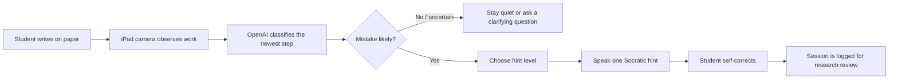
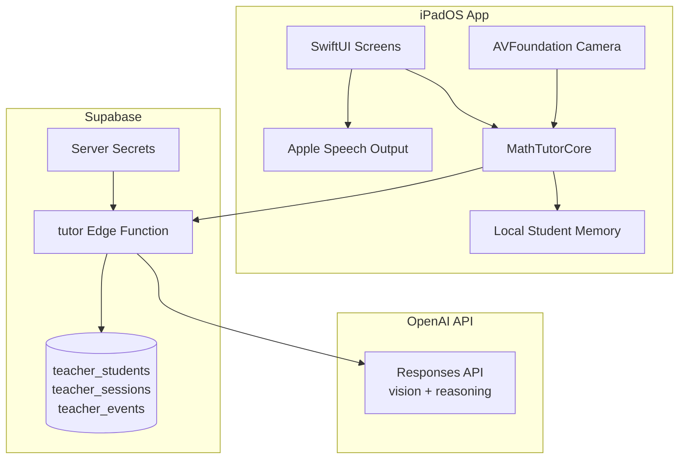
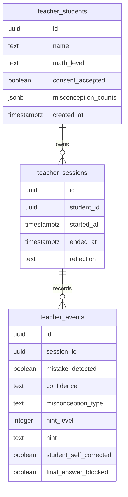
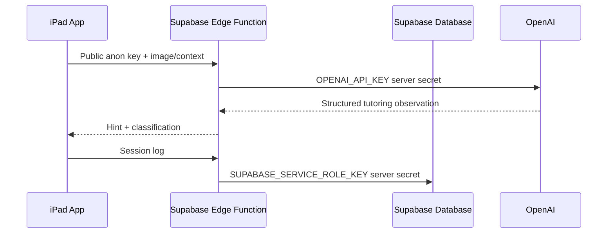

# MathTutor


MathTutor is an iPad-first research prototype for a real-time Socratic math teacher. Instead of scanning a finished problem and giving an answer, the app watches a student work on paper, detects likely process mistakes, remembers each student's patterns, and gives short spoken hints that help the student self-correct.

The core idea: **make the tutor behave less like a calculator and more like a patient teacher sitting beside the student.**


## Product Vision

| Old solver apps | MathTutor JuneVersion |
| --- | --- |
| Scan a problem after it is written | Watch the work as it develops |
| Produce steps and final answers | Ask Socratic questions without revealing answers |
| Treat every student the same | Remember names, habits, and recurring misconceptions |
| Optimize for completion | Optimize for learning and self-correction |

## Experience



## Screens

| Screen | Purpose | Design Rule |
| --- | --- | --- |
| Student Picker | Choose or create a student profile | Fast entry into a tutoring session |
| Consent | Confirm study logging and no-answer mode | Plain language, no clutter |
| Live Tutor Session | Camera-first paper observation | UI stays at the edges of the learning moment |
| Reflection | Summarize checks, mistakes, and corrections | Reinforce progress instead of scores |
| Admin Review | Inspect patterns across sessions | Useful for professor/research review on the iPad |

## Architecture



## Repository Map

```text
.
├── MathTutorSwift/
│   ├── Package.swift
│   ├── Sources/
│   │   ├── MathTutorCore/          # Student memory, policy, models, Supabase client
│   │   └── MathTutorCoreChecks/    # Lightweight verification executable
│   └── iPadApp/MathTutor/          # Native Xcode iPad app project
│       └── MathTutor/
│           ├── Core/               # App-local copy of the core model/API layer
│           └── TeacherUI/          # SwiftUI app screens and design system
├── supabase/
│   ├── functions/tutor/            # OpenAI-backed Edge Function
│   ├── migrations/                 # Fresh JuneVersion schema
│   └── sql/                        # Manual destructive reset script
└── README.md
```

## Data Model



## API Contract

The iPad app calls one Supabase Edge Function: `tutor`.

### `observe_work`

Used when the iPad captures a frame of the student's paper.

```json
{
  "mode": "observe_work",
  "image_base64": "...",
  "student": {
    "id": "student-uuid",
    "name": "Aarav",
    "level": "Algebra II",
    "misconceptions": {
      "sign_error": 2,
      "distribution": 1
    }
  },
  "session": {
    "check_number": 3,
    "no_answer_mode": true
  }
}
```

Returns a structured tutoring decision:

```json
{
  "mistake_detected": true,
  "confidence": "medium",
  "misconception_type": "sign_error",
  "hint_level": 2,
  "hint": "Check the sign when you moved that term.",
  "teacher_note": "Likely sign-change issue.",
  "work_summary": "The student moved a term across the equals sign.",
  "final_answer_blocked": true
}
```

### `log_session`

Used when a tutoring session ends. The Edge Function writes the session to Supabase using the server-only service role key.

## Security Model



The iPad app must never contain:

- OpenAI API keys
- Supabase service-role keys
- private research export credentials

The iPad app may contain:

- Supabase project URL
- Supabase public anon key

## Fresh Database Setup

If you no longer need old app data, reset the Supabase database for JuneVersion.

1. Open Supabase.
2. Export anything you might want from the old project.
3. Open the SQL Editor.
4. Run the full contents of:

```text
supabase/sql/reset_for_june_version.sql
```

That script removes old Flutter-era tables such as `problem_history`, `skills`, and `profiles`, then creates only the new teacher tables.

Set server-side secrets:

```bash
supabase secrets set OPENAI_API_KEY=sk-...
supabase secrets set SUPABASE_SERVICE_ROLE_KEY=your-service-role-key
```

Deploy the Edge Function:

```bash
supabase functions deploy tutor
```

## Swift Verification

The core package can be checked without Xcode:

```bash
cd MathTutorSwift
swift run MathTutorCoreChecks
```

Expected output:

```text
MathTutorCoreChecks passed
```

## Interface Direction

The JuneVersion UI uses a flat STEM notebook language built for tutoring on paper:

- Use a subtle notebook/grid background with lab green, chalkboard green, graphite, cream paper, muted yellow, and rust accents.
- Keep student-facing screens flat: no gradients, no glass effects, no decorative animation, and no dashboard panels.
- Make the camera the dominant Live Session surface with only a compact icon strip over the page.
- Keep visible controls icon-only where possible, with accessibility labels preserved in code.
- Show Teach Mode as math only. No prose paragraphs appear on the teaching surface.
- Let the student interrupt from Teach Mode with a question icon, then return to paper work with icon controls.
- Keep Admin Review detailed enough for research, but style it like a sparse notebook instead of a business dashboard.

The shared SwiftUI style lives in:

```text
MathTutorSwift/iPadApp/MathTutor/MathTutor/TeacherUI/MTDesignSystem.swift
```

## Motorized Holder Prototype

MathTutor includes an app-side prototype for a future motorized iPad tutor holder. The holder concept has two modes:

| Mode | Physical Position | App Behavior |
| --- | --- | --- |
| Observe Mode | Rear camera faces the student's paper | Camera-first UI watches quietly and gives short hints |
| Teach Mode | Screen faces the student | The app shows centered math steps only, then returns to paper work |

The current implementation does not require hardware. The shared `StandController` chooses a simulated controller when no stand URL is configured, so the tutor flow can be tested in Xcode, Simulator, and on an iPad before any motors exist.

Holder controls live in:

```text
MathTutorSwift/iPadApp/MathTutor/MathTutor/TeacherUI/StandControl/
```

The Admin screen has a Holder test sheet with:

- current holder mode,
- last command,
- simulated or HTTP connection mode,
- stand base URL field,
- Observe, Teach, Pitch Down, Pitch Up, Center, and Emergency Stop buttons.

The Live Tutor session stays safe by default:

1. The app starts in Observe Mode.
2. A possible mistake gets a quiet hint without rotating.
3. The student taps the Teach icon to explicitly enter Teach Mode.
4. MathTutor sends `teachMode`, shows centered math steps, and pauses observation.
5. Checkmark or return icons send the holder back to Observe Mode.
6. A cooldown prevents repeated Teach Mode triggers.

### Simulated Mode

Leave the stand URL blank to use simulated mode. The simulated controller logs commands and pretends to rotate over a short delay. This is the correct mode for app development, UI demos, and simulator testing.

### Future ESP32 HTTP Mode

When hardware exists, enter a local base URL such as:

```text
http://math-tutor-stand.local
```

The HTTP controller is prepared for these local Wi-Fi endpoints:

| Command | Endpoint |
| --- | --- |
| Observe Mode / Return to Observe | `POST /observe` |
| Teach Mode | `POST /teach` |
| Center | `POST /center` |
| Pitch Down | `POST /pitch-down` |
| Pitch Up | `POST /pitch-up` |
| Emergency Stop | `POST /stop` |

The app includes local-network privacy text for future holder control. If HTTP control fails, MathTutor keeps the tutoring UI usable and shows a non-blocking error.

Safe hardware testing order:

1. Simulated app flow.
2. ESP32 on the desk with no iPad attached.
3. One-axis rotating empty cradle.
4. iPad mounted only after slow motion and stop controls work.

## Xcode Setup

The native Xcode project lives at:

```text
MathTutorSwift/iPadApp/MathTutor/MathTutor.xcodeproj
```

To run the iPad app:

1. Open `MathTutorSwift/iPadApp/MathTutor/MathTutor.xcodeproj`.
2. Wait for Xcode's iOS platform download to finish if it is still installing.
3. Connect the iPad and trust the Mac.
4. Select the iPad in Xcode's run destination menu.
5. Choose a signing team if Xcode asks.
6. Press Run.

The project is configured as iPad-only, includes camera permission text, and launches the custom MathTutor SwiftUI flow instead of the default template view.

## Research Value

MathTutor is designed to produce study-ready signals:

| Signal | Why It Matters |
| --- | --- |
| Misconception type | Shows what kind of reasoning mistake occurred |
| Hint level | Measures how much support the student needed |
| Self-correction | Captures whether the student learned enough to repair the work |
| Student history | Lets the tutor personalize future guidance |
| No-answer enforcement | Keeps the tool aligned with learning instead of answer retrieval |

## Current Status

| Area | Status |
| --- | --- |
| Swift core models | Implemented |
| No-answer policy | Implemented |
| iPad SwiftUI screen flow | Implemented as source files |
| Camera preview/capture | Implemented |
| Supabase observation function | Implemented |
| Supabase session logging | Implemented |
| Native Xcode project | Builds for iPadOS |
| Flat STEM notebook UI | Implemented |
| Motorized holder software prototype | Simulated + future HTTP interface implemented |
| Real iPad testing | Pending device run |
