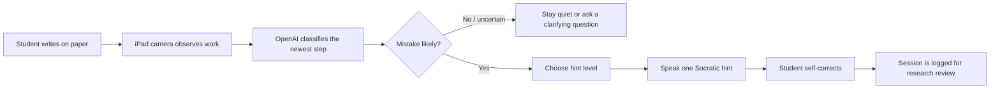
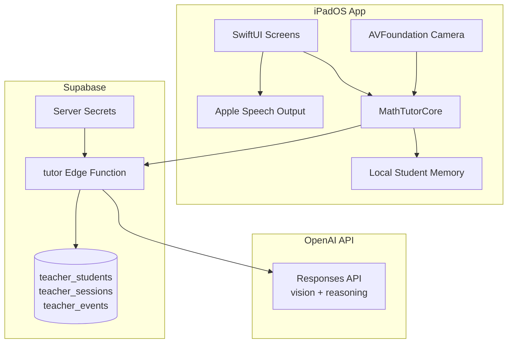
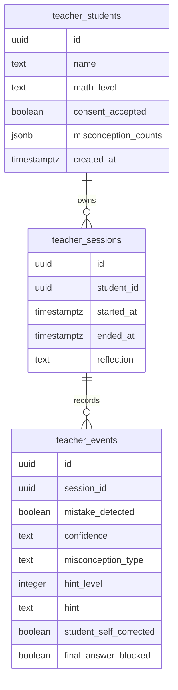
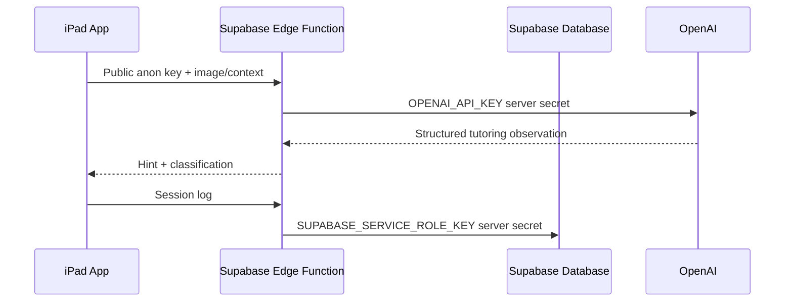

# MathTutor


MathTutor is an iPad-first research prototype for a real-time Socratic math teacher. Instead of scanning a finished problem and giving an answer, the app watches a student work on paper, detects likely process mistakes, remembers each student's patterns, and gives short spoken hints that help the student self-correct.

The core idea: **make the tutor behave less like a calculator and more like a patient teacher sitting beside the student.**

## Product Vision

| Old solver apps | MathTutor JuneVersion |
| --- | --- |
| Scan a problem after it is written | Watch the work as it develops |
| Produce steps and final answers | Ask Socratic questions without revealing answers |
| Treat every student the same | Remember names, habits, and recurring misconceptions |
| Optimize for completion | Optimize for learning and self-correction |

## Experience



## Screens

| Screen | Purpose | Design Rule |
| --- | --- | --- |
| Student Picker | Choose or create a student profile | Fast entry into a tutoring session |
| Consent | Confirm study logging and no-answer mode | Plain language, no clutter |
| Live Tutor Session | Camera-first paper observation | UI stays at the edges of the learning moment |
| Reflection | Summarize checks, mistakes, and corrections | Reinforce progress instead of scores |
| Admin Review | Inspect patterns across sessions | Useful for professor/research review on the iPad |

## Architecture



## Repository Map

```text
.
├── MathTutorSwift/
│   ├── Package.swift
│   ├── Sources/
│   │   ├── MathTutorCore/          # Student memory, policy, models, Supabase client
│   │   └── MathTutorCoreChecks/    # Lightweight verification executable
│   └── iPadApp/MathTutorTeacher/   # SwiftUI iPad app source
├── supabase/
│   ├── functions/tutor/            # OpenAI-backed Edge Function
│   ├── migrations/                 # Fresh JuneVersion schema
│   └── sql/                        # Manual destructive reset script
└── README.md
```

## Data Model



## API Contract

The iPad app calls one Supabase Edge Function: `tutor`.

### `observe_work`

Used when the iPad captures a frame of the student's paper.

```json
{
  "mode": "observe_work",
  "image_base64": "...",
  "student": {
    "id": "student-uuid",
    "name": "Aarav",
    "level": "Algebra II",
    "misconceptions": {
      "sign_error": 2,
      "distribution": 1
    }
  },
  "session": {
    "check_number": 3,
    "no_answer_mode": true
  }
}
```

Returns a structured tutoring decision:

```json
{
  "mistake_detected": true,
  "confidence": "medium",
  "misconception_type": "sign_error",
  "hint_level": 2,
  "hint": "Check the sign when you moved that term.",
  "teacher_note": "Likely sign-change issue.",
  "work_summary": "The student moved a term across the equals sign.",
  "final_answer_blocked": true
}
```

### `log_session`

Used when a tutoring session ends. The Edge Function writes the session to Supabase using the server-only service role key.

## Security Model



The iPad app must never contain:

- OpenAI API keys
- Supabase service-role keys
- private research export credentials

The iPad app may contain:

- Supabase project URL
- Supabase public anon key

## Fresh Database Setup

If you no longer need old app data, reset the Supabase database for JuneVersion.

1. Open Supabase.
2. Export anything you might want from the old project.
3. Open the SQL Editor.
4. Run the full contents of:

```text
supabase/sql/reset_for_june_version.sql
```

That script removes old Flutter-era tables such as `problem_history`, `skills`, and `profiles`, then creates only the new teacher tables.

Set server-side secrets:

```bash
supabase secrets set OPENAI_API_KEY=sk-...
supabase secrets set SUPABASE_SERVICE_ROLE_KEY=your-service-role-key
```

Deploy the Edge Function:

```bash
supabase functions deploy tutor
```

## Swift Verification

The core package can be checked without Xcode:

```bash
cd MathTutorSwift
swift run MathTutorCoreChecks
```

Expected output:

```text
MathTutorCoreChecks passed
```

## Xcode Setup

Full Xcode was not available in the Codex environment, so the native `.xcodeproj` was not generated here.

To run the iPad app:

1. Create a new Xcode iPad App target named `MathTutorTeacher`.
2. Add the Swift files from `MathTutorSwift/iPadApp/MathTutorTeacher`.
3. Add the local Swift package at `MathTutorSwift`.
4. Link the `MathTutorCore` product to the app target.
5. Add camera permission text to `Info.plist`:

```xml
<key>NSCameraUsageDescription</key>
<string>MathTutor uses the camera to observe handwritten math work during tutoring sessions.</string>
```

## Research Value

MathTutor is designed to produce study-ready signals:

| Signal | Why It Matters |
| --- | --- |
| Misconception type | Shows what kind of reasoning mistake occurred |
| Hint level | Measures how much support the student needed |
| Self-correction | Captures whether the student learned enough to repair the work |
| Student history | Lets the tutor personalize future guidance |
| No-answer enforcement | Keeps the tool aligned with learning instead of answer retrieval |

## Current Status

| Area | Status |
| --- | --- |
| Swift core models | Implemented |
| No-answer policy | Implemented |
| iPad SwiftUI screen flow | Implemented as source files |
| Camera preview/capture | Implemented |
| Supabase observation function | Implemented |
| Supabase session logging | Implemented |
| Native Xcode project | Pending Xcode setup |
| Real iPad testing | Pending device run |
