# Current MathTutor UI Gallery

Screenshots captured from the iPad Air 11-inch simulator on 2026-06-26. These are actual app screenshots, not mockups.

## Student Picker

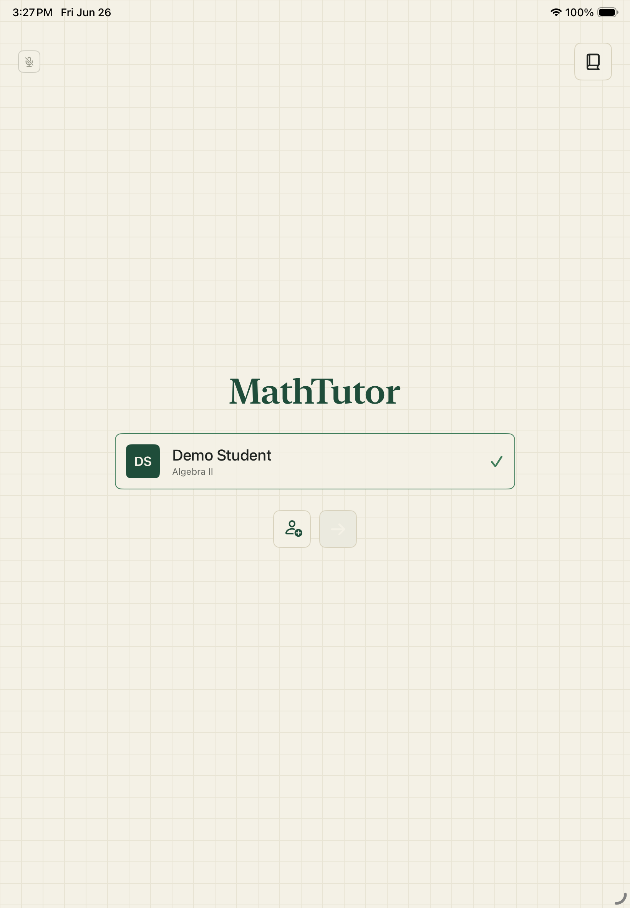

Simple centered student selection. This is the entry point before consent and session start.

## New Student Sheet

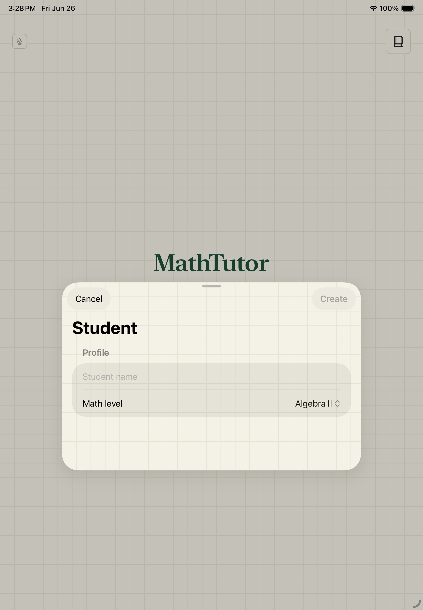

The new student flow is reachable and allows a student profile to be created locally in the simulator.

## Consent / Study Mode

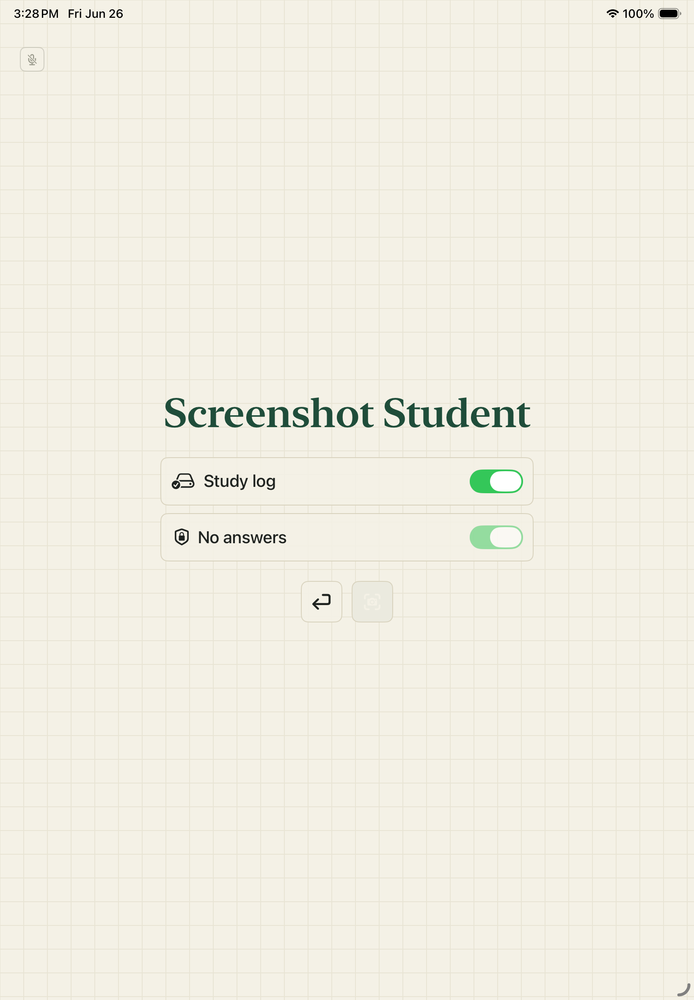

The consent screen confirms study logging and no-answer mode before a tutoring session begins.

## Live Scan Screen

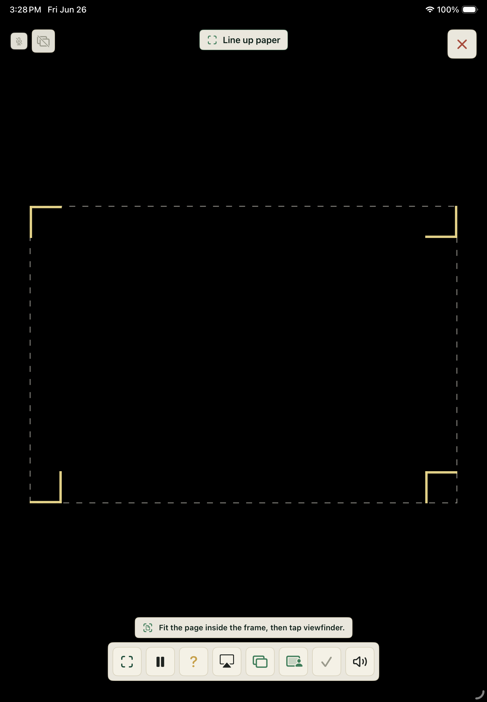

The Live Session screen keeps the camera surface dominant. The scan guide tells the student how to frame the paper without turning the page into a dashboard.

## Live Scan Screen With Labels

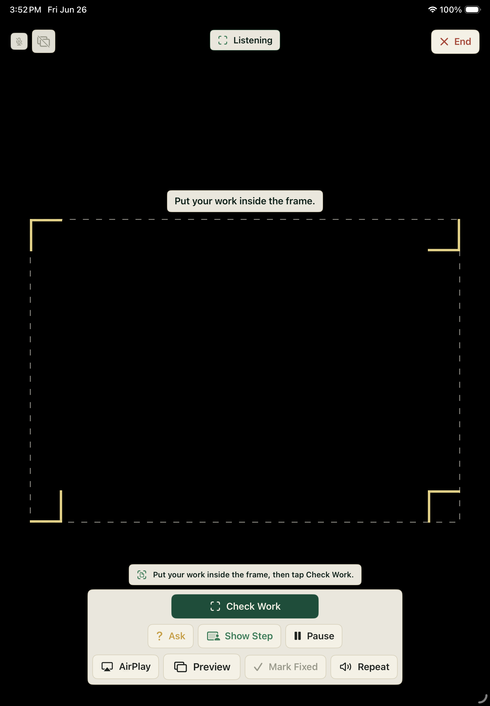

The current scan screen uses visible button text for the main student actions: Check Work, Ask, Show Step, Pause, AirPlay, Preview, Mark Fixed, Repeat, and End.

## Live Scan After Check

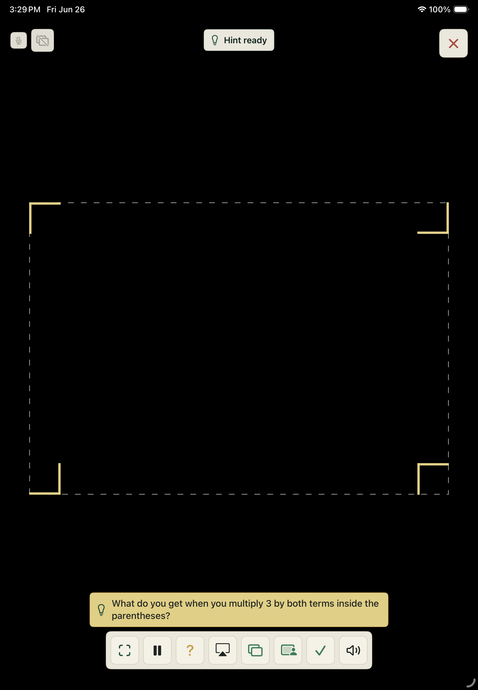

After tapping the check control in simulator, the app returned a valid hint and displayed it in the scan overlay.

## Live Scan After Hint With Labels

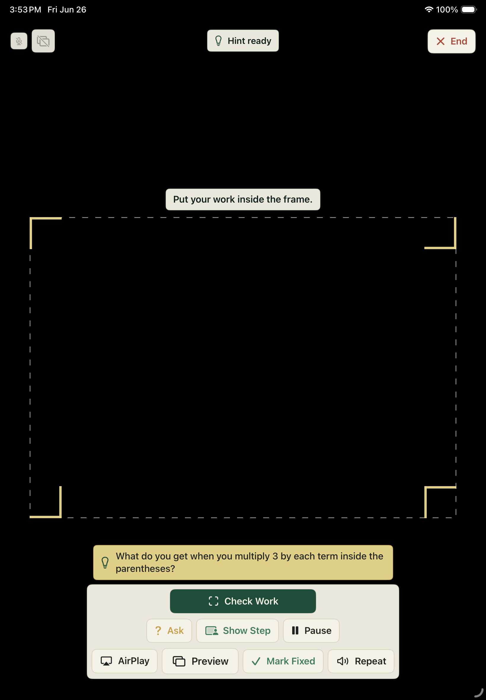

After Check Work finishes, the screen changes to Hint ready and keeps the hint compact below the paper frame.

## Teach Mode

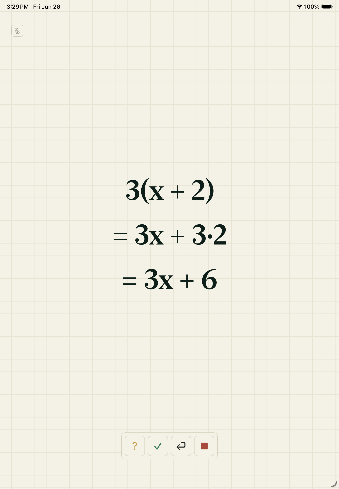

Teach Mode uses centered math steps instead of prose explanations.

## Teach Mode From Observation

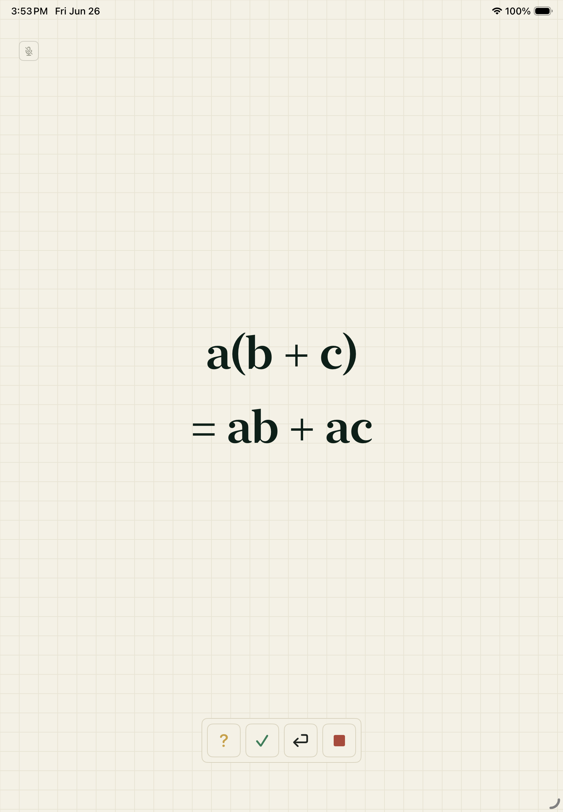

Teach Mode now uses the latest observation when available. In this simulator run, the deployed backend did not yet return `teach_steps`, so the app used the local distribution board for the returned misconception type.

## Teach Mode With Backend Steps

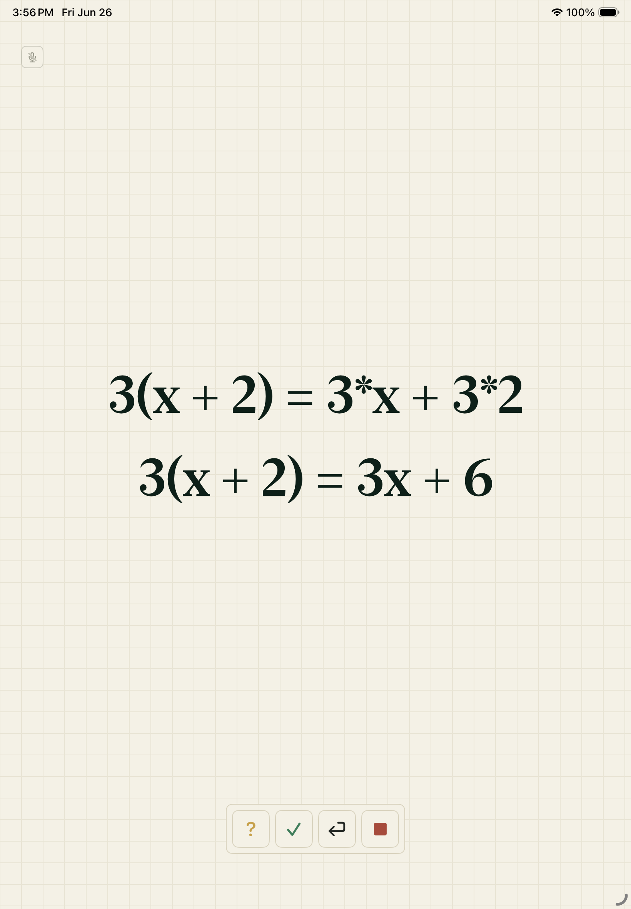

After deploying the updated tutor Edge Function, Teach Mode used backend-returned `teach_steps` for the observed `3(x + 2)` problem.

## Reflection

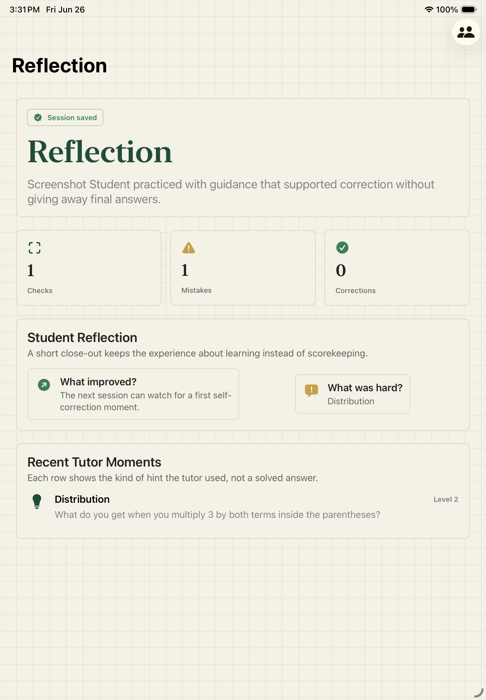

The Reflection screen appears after ending a tutoring session and summarizes the completed work.

## Admin Review

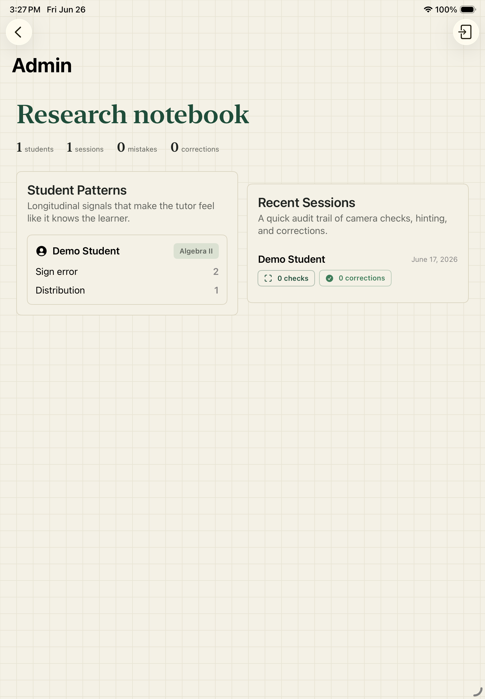

Admin Review is reachable and styled as a sparse student history rather than a business dashboard.

## Holder / Voice Debug

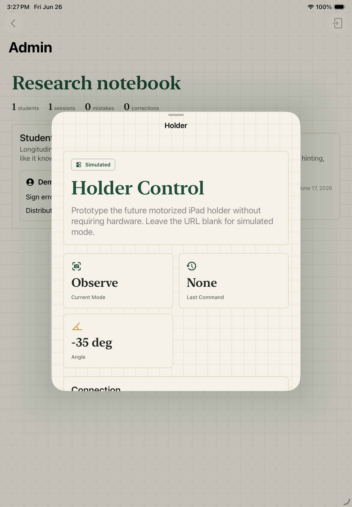

The holder and voice debug controls are reachable from Admin Review. Simulator testing shows microphone input is unavailable, so real iPad voice testing is still needed.

## External Display Preview

The simulator-only external display preview is reachable and shows the math-board output path used for AirPlay/external-display work.

## External Display From Observation

The simulator external display preview uses the same latest-observation step source as Teach Mode.

## External Display With Backend Steps

The simulator external display preview also used the backend-returned `teach_steps`, which verifies the AirPlay/external-display board path is no longer stuck on the old canned demo.
